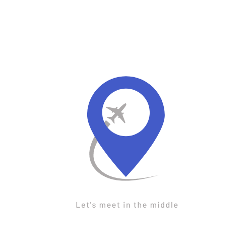
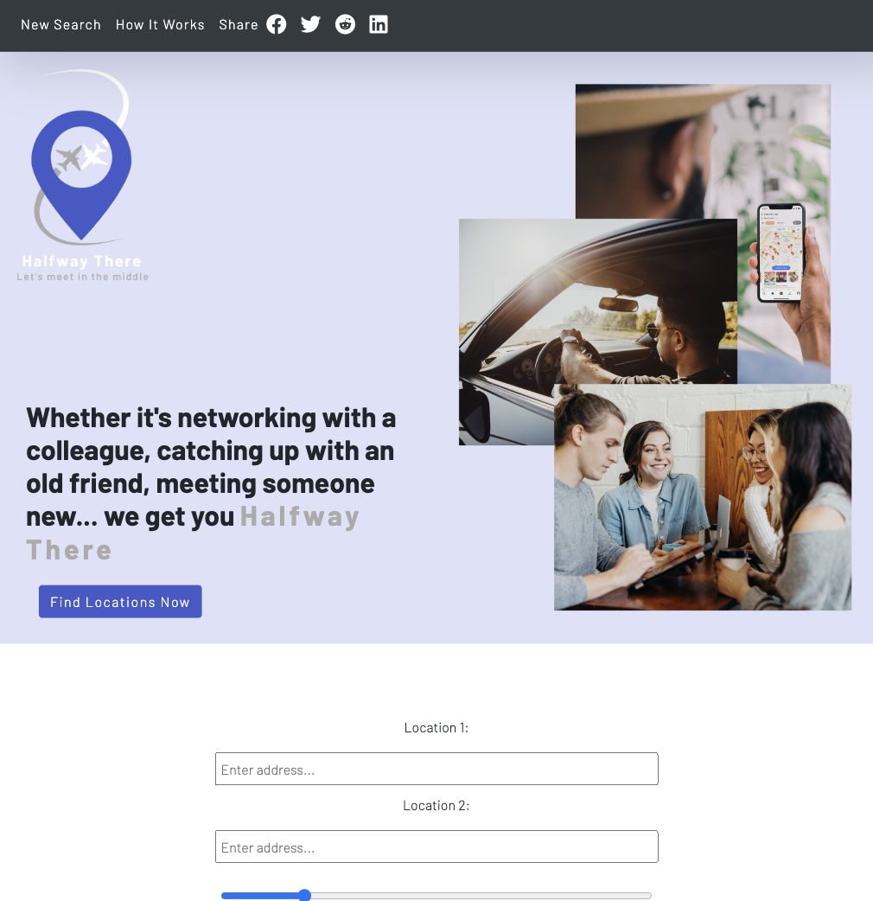

# Halfway There

  

<strong>Purpose of the app:</strong> Cut down on travel time and gas money between two users by utilizing google apis and js algorithms to bring a center point location between them. Display highest rated sit-down locations first to user marketed towards the center point location.   
<strong>How to use:</strong> User enters two locations, the location they are coming from and the location of the person they want to meet with. Adjust the radius for more or less options and search by clicking the 'Places near halfway point' button. User will then be presented with a list of locations near the centerpoint to choose as their destination. They can then click on any location for further details such as how many stars, operation status and the address - which can they be copied and pasted into Google maps.  
<strong>Features on the app:</strong> Adjustable radius slider in case user would like to be presented with more or less options, highest rated establishments are shown first.

## Technologies

Javascript, HTML, CSS, Bootstrap, Leaflet API and Open Street Map, Google Cloud Platform: Google Maps API and Google Places API

<!-- AUTHORS-->

## Site was Built By:

<a href="https://github.com/mendo94">Rina Mendoza</a>

<a href="https://github.com/DCXan">David Chen</a>

<!-- SITE PREVIEW -->

## Site Preview

  

<!-- Web Demo -->

## Web Demo

https://youtu.be/Jx5HYiz_7RM

<!-- ACKNOWLEDGMENTS -->

## Acknowledgments

Project could not have been made without the help of:

- [Bootstrap Cheat Sheet](https://hackerthemes.com/bootstrap-cheatsheet/)
- [Font Awesome](https://fontawesome.com)
- [Google Cloud Platform](https://console.cloud.google.com/apis/dashboard?project=halfandhalfproject)
- [Leaflet and Open Street Map](https://leafletjs.com/)

(<a href="#top">back to top</a>)

